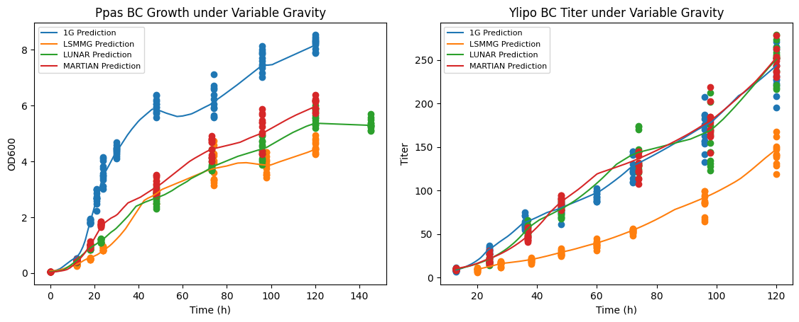

# Towards Biomanufacturing on Mars
This is a repository containing the ML models constructed for the DARPA Biomanufacturing: Survival, Utility, and Reliability beyond Earth (B-SURE) project: [https://www.darpa.mil/program/biomanufacturing-survival-utility-and-reliability-beyond-earth](https://www.darpa.mil/program/biomanufacturing-survival-utility-and-reliability-beyond-earth). Although B-SURE objectives are to identify the effects of variable gravity, alternate feedstocks, and radiation on the impact on biological organisms, the focus of this work is on the impact of variable gravity.

A series of models are trained on optimization objectives growth and titer: Neural networks (NNs), Probabilistic neural networks (PNNs), and PNNs with transfer learning. The NNs and PNNs are trained on HARV data collected on Earth, whereas the PNNs with transfer learning are models retrained on space data. In all models, the inputs are organism type, bioproduct type, gravity level, time and the outputs are growth and titer.

## Neural Networks

*Examples of NN models trained for yeasts Pichia pastoris (P.pas) and Yarrowia lipolytica (Y.lipo) with beta-carotene (BC) across gravities of 1G (Earth), Low Shear Modeled Microgravity (LSMMG), Lunar, Martian*

## Probabilistic Neural Networks
insert PNN plots

## Probabilistic Neural Networks with Transfer Learning
insert 95% CI before/after
