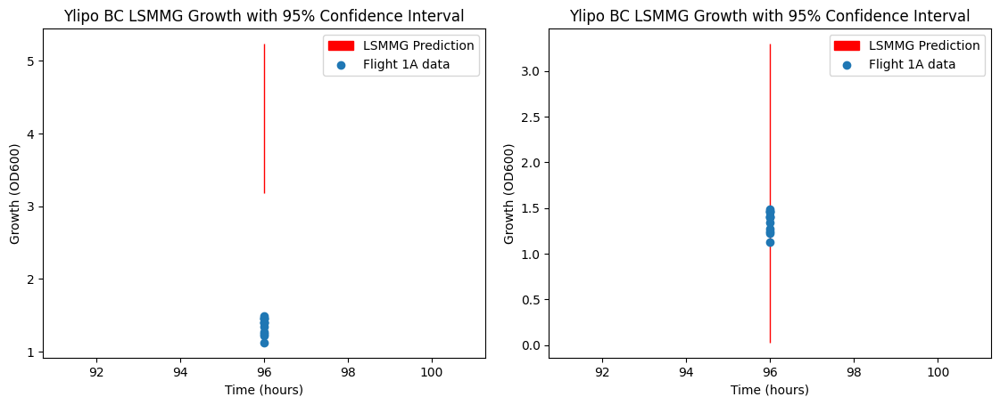

# Deep Learning for Towards Biomanufacturing on Mars
This is a repository containing the ML models constructed for the DARPA Biomanufacturing: Survival, Utility, and Reliability beyond Earth (B-SURE) project: [https://www.darpa.mil/program/biomanufacturing-survival-utility-and-reliability-beyond-earth](https://www.darpa.mil/program/biomanufacturing-survival-utility-and-reliability-beyond-earth). The focus of this work is on identifying the impact of variable gravity on biological organsism in space.

A series of models are trained on optimization objectives growth and titer: Neural networks (NNs), Probabilistic neural networks (PNNs), and PNNs with transfer learning. The NNs and PNNs are trained on HARV data collected on Earth, whereas the PNNs with transfer learning are models retrained on space data. In all models, the inputs are organism type, bioproduct type, gravity level, time and the outputs are growth and titer.

## Neural Networks

*Examples of NN models trained for growth (left) and titer (right) for yeasts Pichia pastoris (P.pas) and Yarrowia lipolytica (Y.lipo) respectively with beta-carotene (BC) across gravities of 1G (Earth), Low Shear Modeled Microgravity (LSMMG), Lunar, Martian.*

The NNs make accurate predictions of the data, but they are limited to means in inference, hindering efforts in uncertainty quantification and motivating the use of probabilistic neural networks.

## Probabilistic Neural Networks

*Examples of PNNs for growth (left) and titer (right) for Pichia pastoris (P.pas) Escherichia coli (E.coli) respectively with beta-carotene (BC) across gravities of 1G (Earth), Low Shear Modeled Microgravity (LSMMG), Lunar, Martian.*

The advantage of using PNNs instead of NNs is the variance can also be inferred, allowing 95% confidence intervals to be constructed to provide further insight on the true growths and titers of the different organisms under variable gravity conditions. However, the datasets are derived from simulated gravities on Earth, meaning there are discrepancies with data collected under variable gravities in space.

## Probabilistic Neural Networks with Transfer Learning

*Examples of 95% confidence intervals before (left) and after (right) transfer learning is performed on the PNNs for Y.lipo BC LSMMG Growth (top) and P.pas BC 1G Titer (bottom).*

To resolve the discrepancy between data collected on Earth and space, transfer learning where the last layer of the PNNs are fine-tuned is performed. The 95% confidence intervals before and after transfer learning verify the increased accuracy in inference for real space conditions as: (a) better agreement between the models and space data, (b) the 95% confidence interval ranges are much narrower, leading to increased confidence on true growth and titer.
